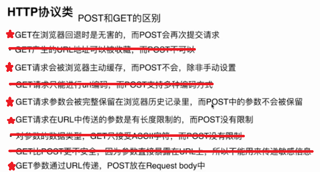
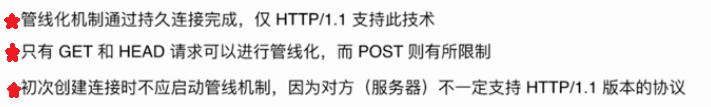
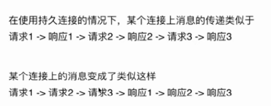

# Job Interview

## 职位描述(What need you to do)
1. 系统化设计(项目实战)

    * 模块化设计
    * 前后端分离
    * 数据渲染(数据mock)

2. 动画

    * dom
    * svg路径
    * canvas
    * css3 (过渡旋转)
    * web request动画帧 [requestAnimationFrame](https://www.zhangxinxu.com/wordpress/2013/09/css3-animation-requestanimationframe-tween-%E5%8A%A8%E7%94%BB%E7%AE%97%E6%B3%95/)

3. 微信开发

    * 开发文档
    * 微信项目
    * 技术论坛微信开发的坑

3. 组件库的建立 -- 难度星级 *****
    * 基本功（原生js/css理解和使用）
    * 组件库项目开发经验
    * 组件库源码通读

4. 现有项目的优化和重构 -- 难度星级 *****

5. 至少熟悉一种MVC框架及实战经验
    * 项目实战
    * 技术论坛准备项目实战的问题  -- 重要星级 *****

6. 最新的web标准-->es6/es7

7. HTML5新规范

8. 架构与设计能力 -- 难度星级**********
    * 项目目录结构
    * 复用性
    * 自动化测试
    * 模块化
    * 代码易读易维护

9. 用户体验
    * 介绍的时候在完成功能的前提下，突出自己做出了哪些改进

10. 可用性、可访问性知识
    * 异常处理
        1. 运行异常
            > window.onerror()捕获
        2. 资源加载错误
            > [https网页加载http资源导致的页面报错及解决方案](https://blog.csdn.net/wz947324/article/details/80067432)

11. 对前端的兴趣/研究前沿技术
    * 技术博客/技术论坛最新的技术点看一下(了解即可)

12. 工程化工具，搭建环境
    * webpack 必用
    * gulp 常用(一定要看下，gulp和grunt的区别看下)
    * grunt 较少也需

13. 代码风格
    * 代码语义化
    * 函数功能单一，OOP

    ···· 以此类推

14. 软技能
    * hr沟通自圆其说
    * smile

15. 后端语言/NodeJs不强求

## 技术栈准备

    jQuery 源码 --> 核心架构
                   事件委托
                   插件机制
                   兼容性（次之）
           渠道 --> 博客文章

    三大框架准备1-2个
    Vue     源码（重要）
            渠道 --> 博客文章（将技术博客常问的问题筛选）
    React   源码（重要，比较火）
    Angular

    NodeJs --> unnecessory

    sass     --> 技术博客
    less     --> 技术博客
    gulp     --> 技术博客
    npm      --> 技术博客
    webpack  --> 技术博客

## 自我介绍
   1. 简历
      > 基本信息 : 姓名&年龄&手机&邮箱&籍贯&学历

      > 工作经历 : 时间、公司、岗位、职责、技术栈、业绩（业务收益&技术收益）

   2. 自我陈述
      * 把握面试的沟通方向
      * 豁达、自信

              是xxx项目负责人 -- wrong
              负责xxx项目    -- wrong

          > 回答技巧
              step1: 平时喜欢研究技术网站
              step2: 喜欢看其中的原理思考
              step3: 尝试有没有更好地方式

## 一面/二面 --> 基础知识(理论知识)
### 页面布局

    Demo牛刀小试:  interview/layout.html
    假设高度已知，实现三栏布局，其中左右两栏各300px,中间自适应，你有几种实现方式？

        > 浮动
            兼容性好     脱标
        > 定位
            快速        可使用性差 脱标且子元素全部脱标
        > flexBox
            比较完美
        > display:table-cell
            比较完美    三栏若其中一栏高度撑出，其余两栏会相应变化
        > grid 网格布局
            简洁完美

    布局优缺点？

    假设高度未知？
        > flexBox
        > display:table-cell

    TodoList:
        三栏布局:
            左右宽度固定，中间自适应
            上下高度固定，中间自适应
        两栏布局:
            左宽度固定，右自适应
            右宽度固定，左自适应
            上高度固定，下自适应
            下高度固定，上自适应

### CSS盒模型
* 对CSS盒模型的理解？
* 基本概念（标准模型和IE模型）
* 标准模型和IE模型区别


* CSS如何设置两种模型？
```
    box-sizing:content-box; 标准模型
    box-sizing:border-box;  IE模型
```
* JS如何获取对应盒模型的宽高
```
    dom.style.width/height (仅限内联样式即行内样式)
    dom.currentStyle.width/height (获取渲染以后的宽高，但是仅支持IE)
    window.getComputedStyle(dom).width/height (兼容性更好)
    dom.getBoundingClientRect.width/height (获取视口绝对位置)
```
* 根据盒模型解释边距重叠(父子元素、兄弟元素、空元素)
        interview/box.html
* BFC解决方案
    BFC基本概念(块级格式化上下文)
    BFC原理
        1. 垂直方向会重叠
        2. BFC区域不会与浮动元素重叠(用于清除浮动)
        3. 内外元素互不影响
        4. 计算BFC高度时，浮动元素也会参与计算
        interview/bfc.html
    如何创建BFC?
        1. float属性不为none
        2. position为absolute或fixed
        3. display为inline-block, table-cell, table-caption, flex, inline-flex
        4. overflow不为visible
    BFC使用场景
    [BFC的原理简介及其一些应用](http://www.cnblogs.com/lhb25/p/inside-block-formatting-ontext.html)

### DOM事件
* DOM事件级别
    1. element.onclick=function(){}
    2. element.addEventListener('click',function(){},false)
    3. 事件扩充 element.addEventListener('keyup',function(){},false)

* DOM事件模型

        捕获、冒泡

* DOM事件流

        事件捕获作用到目标对象，该对象冒泡(上传)到window


* 描述DOM事件捕获的具体流程

        window -> document -> html -> body -> ··· -> 目标元素
        interview/event.html
        反之即冒泡的流程

* Event对象的常见应用

        event.preventDefault()
        event.stopPropagation()
        event.stopImmediatePropagation()
        event.currentTarget()
        event.target()

* 自定义事件

    ```
    两者区别在于传参
    Condition 1 --> Event
    var eve = new Event('ppc');
    ev.addEventListener('ppc',function(){
        console.log('ppc')
    })
    ev.dispatchEvent(eve)

    Condition 2 --> CustomEvent
    // 创建并分发事件
    var event = new CustomEvent("cat", {"detail":{"hazcheeseburger":true}})
    // 添加一个适当的事件监听器
    obj.addEventListener("cat", function(e) { process(e.detail) })
    obj.dispatchEvent(event)
    ```
[CustomEvent](https://developer.mozilla.org/zh-CN/docs/Web/API/CustomEvent)

### http协议
* http协议的主要特点

        简单快速(每个资源固定，统一资源符UII)
        灵活(一个http协议就可以完成不同数据类型的传输)
        无连接(非keep-alive模式下，每个请求/应答模式都会建立连接一次，完成后会断开)
        无状态(http协议无法区分连接者的身份，如客户端或服务端)

* [ http报文的组成部分](https://www.cnblogs.com/sjm19910902/p/6423181.html)

    请求报文:
        请求行(http方法、页面地址、协议、版本)、
        请求头(由键值对组成,通知服务器有关于客户端请求的信息)、
        空行(分隔请求头和请求体，通知服务器请求头结束)、
        请求体(请求数据)
    响应报文:
        状态行(协议、版本号、状态码)、
        响应头(同上)、
        空行、
        响应体
* http协议的方法
        GET(获取资源)
        POST(查询资源)
        PUT(更新资源)
        DELETE(删除资源)
        HEAD(获取报文首部资源)
   

* 常见状态码
       1xx：指示信息--表示请求已接收，继续处理。
       2xx：成功--表示请求已被成功接收、理解、接受。
       3xx：重定向--要完成请求必须进行更进一步的操作。
       4xx：客户端错误--请求有语法错误或请求无法实现。
       5xx：服务器端错误--服务器未能实现合法的请求。

       200 OK：客户端请求成功
       206 : 客户端上传视频/音频文件很大，发送一个带有Range头的GET请求，服务器完成了。
       301 : 永久重定向
       302 : 临时重定向
       304 : 有缓存，可从缓存中取数据
       400 Bad Request：客户端请求有语法错误，不能被服务器所理解。
       401 Unauthorized：请求未经授权，这个状态代码必须和WWW-Authenticate报头域一起使用。
       403 Forbidden：服务器收到请求，但是拒绝提供服务。
       404 Not Found：请求资源不存在，举个例子：输入了错误的URL。
       500 ：服务器发生不可预期的错误。
       503 ：服务器当前不能处理客户端的请求，一段时间后可能恢复正常，举个例子：HTTP/1.1 200 OK（CRLF）。

* http协议的主要特点
    * 支持持久连接(http 1.1+支持)
    

    * 管线化
         * 特点
       

         * 原理

       

### 面向对象
   1. 类与实例

            类的声明
            function Cat(){
                this.name = 'cxx';
            }
            es6声明
            class Cat(){
                constructor(){
                    this.name = 'cxx';
                }
            }
            实例化
            console.log(new Cat())

   2. 类与继承
    * 构造函数实现继承

              function Mi(){
                 this.name = 'mimi';
              }
              Mi.prototype.say = 'miaomiao';
              // 缺点：构造函数原型上的属性方法不可实现继承
              function Miao(){
                 Mi.call(this); //apply
                 this.type = 'cat';
              }
              console.log(new Miao())

    * 原型链实现继承

            function Mi(){
                this.name = 'mimi';
            }
            function Miao(){
                this.name = 'miaomiao';
                this.play = []
            }
            Mi.prototype = new Miao()
            var mi1 = new Mi();
            var mi2 = new Mi();
            mi1.play.push(2)
            // 缺点：原型链中的原型对象是共用的，所以改变实例对象的时候会相互影响
            console.log(mi1.play)
            console.log(mi2.play)

    * 组合继承

              function Parent3 () {
                  this.name = 'parent3';
                  this.play = [1, 2, 3];
              }
              function Child3 () {
                  Parent3.call(this);
                  this.type = 'child3';
              }
              Child3.prototype = new Parent3();
              var s3 = new Child3();
              var s4 = new Child3();
              s3.play.push(4);
              console.log(s3.play, s4.play);

              // 优化1 ：避免实例化多次
              function Parent3 () {
                  this.name = 'parent3';
                  this.play = [1, 2, 3];
              }
              function Child3 () {
                  Parent3.call(this);
                  this.type = 'child3';
              }
              Child3.prototype = Parent3.prototype ;
              var s3 = new Child3();
              var s4 = new Child3();
              s3.play.push(4);
              console.log(s3.play, s4.play);

              // 优化2 :
              function Parent3 () {
                  this.name = 'parent3';
                  this.play = [1, 2, 3];
              }
              function Child3 () {
                  Parent3.call(this);
                  this.type = 'child3';
              }
              Child3.prototype = Object.create(Parent3.prototype);
              Child3.prototype.constructor = Child3;
              var s3 = new Child3();
              console.log(s3 instanceof Parent3)   --> true

### 原型链
   * 创建对象的几种方法
   1. 字面量
            > var obj = {a:12}
            > var o = new Object({a:23})
   2. 构造函数
            var M = function(name){this.name=name}
            var o = new M('cxx')
   3. Object.create()
            var o = {a:34}
            var o2 = Object.create(o)
            o2 --> {}
   * 原型、构造函数、对象实例、原型链
     (原型图解释)
   * instanceOf原理
            判断实例对象的__proto__属性是否与构造函数的原型引用同一个地址
   * new运算符

            var new = function(func){
                创建一个空对象，关联到构造函数的原型
                var o = Object.create(func.prototype)
                使构造函数内部this指向新对象
                var k = func.call(o)
                验证对象是否为object,返回该对象
                if(typeof k == 'object'){
                    return k
                }else {
                    return o
                }
            }

### 通信
  * 跨域通信
  * 普通前端通信
    1. 同源策略(同一端口&域名&协议)

            限制:
                Cookies/localStorage/indexDB无法获取
                DOM无法获取
                ajax请求不能发送

    2. 前后端如何通信

            Ajax(限于同源)
            WebSocket(不限于同源)
            CORS(支持同源&跨域)

    3. 如何创建ajax

            代码要体现以下几点：****(参考)
                XMLHttpRequest对象的工作流程
                兼容性处理(询问面试官我是否需要体现兼容性处理)
                事件触发条件
                事件触发顺序
                /**
                 * [json 实现ajax的json]
                 * @param  {[type]} options [description]
                 * @return {[type]}         [description]
                 */
                 util.json = function (options) {
                     var opt = {
                         url: '',
                         type: 'get',
                         data: {},
                         success: function () {},
                         error: function () {},
                     };
                     util.extend(opt, options);
                     if (opt.url) {
                         // 考虑到兼容
                         var xhr = XMLHttpRequest
                            ? new XMLHttpRequest()
                            : new ActiveXObject('Microsoft.XMLHTTP');
                         var data = opt.data,
                             url = opt.url,
                             type = opt.type.toUpperCase(),
                             dataArr = [];
                         for (var k in data) {
                             dataArr.push(k + '=' + data[k]);
                         }
                         if (type === 'GET') {
                             url = url + '?' + dataArr.join('&');
                             xhr.open(type, url.replace(/\?$/g, ''), true);
                             xhr.send();
                         }
                         if (type === 'POST') {
                             xhr.open(type, url, true);
                             xmlhttp.setRequestHeader('Content-type', 'application/x-www-form-urlencoded');
                             xhr.send(dataArr.join('&'));
                         }
                         xhr.onload = function () {
                             // 206 媒体资源体积大
                             if (xhr.status === 200 || xhr.status === 304 || xhr.status === 206) {
                                 var res;
                                 if (opt.success && opt.success instanceof Function) {
                                     res = xhr.responseText;
                                     if (typeof res ==== 'string') {
                                         res = JSON.parse(res);
                                         opt.success.call(xhr, res);
                                     }
                                 }
                             } else {
                                 if (opt.error && opt.error instanceof Function) {
                                     opt.error.call(xhr, res);
                                 }
                             }
                         };
                     }
                 };

    4. 跨域通信的几种方式(五种都要说出来)
        * JSONP

                问题引申：
                    原理？
                     /**
                      * [function 在页面中注入js脚本]
                      */
                     util.createScript = function (url, charset) {
                         var script = document.createElement('script');
                         script.setAttribute('type', 'text/javascript');
                         charset && script.setAttribute('charset', charset);
                         script.setAttribute('src', url);
                         script.async = true;
                         return script;
                     };
                    util.jsonp = function (url, onsuccess, onerror, charset) {
                         var callbackName = util.getName('tt_player');
                         window[callbackName] = function () {
                             if (onsuccess && util.isFunction(onsuccess)) {
                                 onsuccess(arguments[0]);
                             }
                         };
                         var script = util.createScript(url + '&callback=' + callbackName, charset);
                         script.onload = script.onreadystatechange = function () {
                             if (!script.readyState || /loaded|complete/.test(script.readyState)) {
                                 script.onload = script.onreadystatechange = null;
                                 // 移除该script的 DOM 对象
                                 if (script.parentNode) {
                                     script.parentNode.removeChild(script);
                                 }
                                 // 删除函数或变量
                                 window[callbackName] = null;
                             }
                         };
                         script.onerror = function () {
                             if (onerror && util.isFunction(onerror)) {
                                 onerror();
                             }
                         };
                         document.getElementsByTagName('head')[0].appendChild(script);
                     };

                    如何实现？

        * Hash ( url中?后search的改变会刷新页面，但url中#后的hash不会 )

        * postMessage(h5新增)

                产生背景：同源策略限制跨域通信，但是现实业务又需要跨域通信

        * WebSocket
        * CORS
            可以理解为支持跨域通信的ajax

### 安全
  * CSRF
  * XSS (慕课免费视频)

### 算法

# 学习锦囊
   * [Js](https://yuchengkai.cn/docs/frontend/#new)
   * [display:table-cell布局](https://www.zhangxinxu.com/wordpress/2010/10/%E6%88%91%E6%89%80%E7%9F%A5%E9%81%93%E7%9A%84%E5%87%A0%E7%A7%8Ddisplaytable-cell%E7%9A%84%E5%BA%94%E7%94%A8/)
   * [知识梳理集锦](https://juejin.im/post/5c64d15d6fb9a049d37f9c20)


