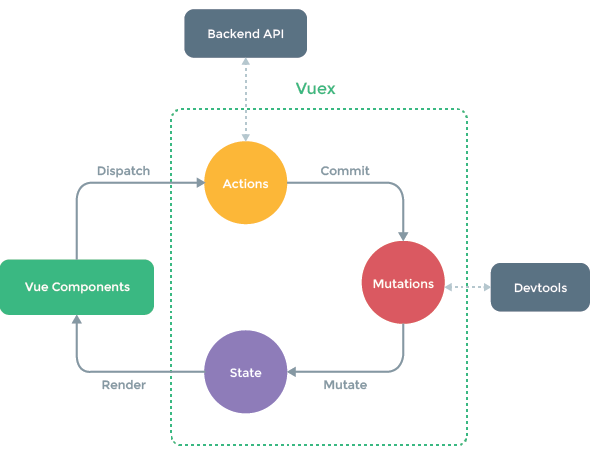

# Vue2.5 阅友书架

## 项目简介

   1. epubjs阅读器引擎介绍
    * 基于JS，解决了ePub电子书的解析、渲染、定位等技术难题
    * 提供了媲美原生app的阅读体验

   2. Node环境
    * 基于V8引擎，让js代码脱离浏览器运行
    * vue-cli3.0需要nodeJs8.9+版本
    * 使用nvm/nvm-windows在同一电脑管理多个node版本

   3. web字体（谷歌）
   4. 引入scss

           --> 引入public文件下的样式文件
                <link rel="stylesheet" href="<%= BASE_URL %>fonts/daysOne.css">

           --> 将public下的样式文件放到assets下，在main.js文件中引入
                import './assets/styles/icon.css'

   5. 配置rem(px2rem组件原理)

          // Dom加载完成触发
          document.addEventListener('DOMContentLoaded', () => {
            const html = document.querySelector('html');
            let fontSize = window.innerWidth / 10;
            fontSize = fontSize > 50 ? 50 : fontSize
            html.style.fontSize = fontSize + 'px';
          })

          // scss 样式处理
          $ratio :375 / 10;

          @function px2rem($px){
            @return $px/$ratio + rem;
          }

   6. VueX(状态管理模式)

            使用场景：多个组件(存在层级关系的组件)在传参和调用时需要一层一层传递
            state：数据共享区，存储状态
            mutations：改变数组的存储状态
            actions：异步调用Mutation
                组件调用触发actions中的api,如addCount()
                this.$store.dispatch('addCount',1)
            mapGetters原理
                const getters = {
                    a: () => 1,
                    b: () => 2
                }
                function mapGetters(keys){
                    const data = {}
                    keys.forEach((key)=>{
                        if(getters.hasOwnProperty(key)){
                            data[key] = getters[key]
                        }
                    })
                    return data
                }

        

   7. vue-devtools(代码调试工具)

            命令：npm install -g @vue/devtools
                 vue-devtools
            代码配置：
                 

## 学习锦囊
   * [web字体](https://www.jianshu.com/p/796bf490186c)
   * [rem配置](https://www.jianshu.com/p/7e98f9c44c97)
   * [vuex使用详解](https://blog.csdn.net/mjzhang1993/article/details/78321903)
   * [超牛逼](http://shengxinjing.cn/fe/qa.html#9db8)
   * [nginx安装及启动配置](https://www.cnblogs.com/jiangwangxiang/p/8481661.html)
   * [关于ngnix命令不识别问题](https://blog.csdn.net/baidu_35901646/article/details/80539698)