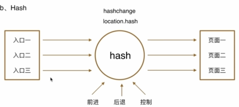
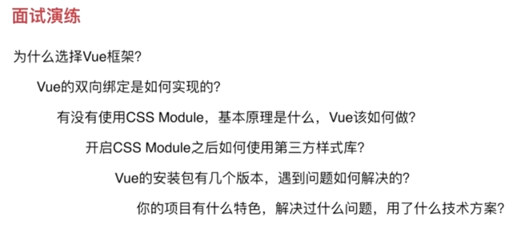
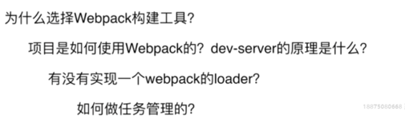
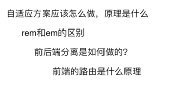

# Vue2.5

## 项目简介

   1. epubjs阅读器引擎介绍
    * 基于JS，解决了ePub电子书的解析、渲染、定位等技术难题
    * 提供了媲美原生app的阅读体验

   2. Node环境
    * 基于V8引擎，让js代码脱离浏览器运行
    * vue-cli3.0需要nodeJs8.9+版本
    * 使用nvm/nvm-windows在同一电脑管理多个node版本
    * [使用nvm管理node版本](https://blog.csdn.net/qq_32682137/article/details/82684898)
    * [webpack3.10.0](https://doc.webpack-china.org)
    * [babel](https://babeljs.cn/docs/usage/polyfill/)
    * [eslint](http://eslint.cn/user-guide/configuring)
    * [ES6](http://es6-features.org/#DefaultParameterValues)
    * [Sass](http://sass.bootcss.com)
    * VueJs

   3. web字体（谷歌）

   4. 引入scss

           cnpm install node-sass --save-dev
           cnpm install sass-loader --save-dev

           --> 引入public文件下的样式文件
                <link rel="stylesheet" href="<%= BASE_URL %>fonts/daysOne.css">

           --> 将public下的样式文件放到assets下，在main.js文件中引入
                import './assets/styles/icon.css'

   5. 配置rem(px2rem组件原理)

          // Dom加载完成触发
          document.addEventListener('DOMContentLoaded', () => {
            const html = document.querySelector('html');
            let fontSize = window.innerWidth / 10;
            fontSize = fontSize > 50 ? 50 : fontSize
            html.style.fontSize = fontSize + 'px';
          })

          // scss 样式处理
          $ratio :375 / 10;

          @function px2rem($px){
            @return $px/$ratio + rem;
          }

   6. VueX(状态管理模式)

            使用场景：多个组件(存在层级关系的组件)在传参和调用时需要一层一层传递
            state：数据共享区，存储状态
            mutations：改变数组的存储状态
            actions：异步调用Mutation
                组件调用触发actions中的api,如addCount()
                this.$store.dispatch('addCount',1)
            mapGetters原理
                const getters = {
                    a: () => 1,
                    b: () => 2
                }
                function mapGetters(keys){
                    const data = {}
                    keys.forEach((key)=>{
                        if(getters.hasOwnProperty(key)){
                            data[key] = getters[key]
                        }
                    })
                    return data
                }

        

   7. vue-devtools(代码调试工具)

            命令：npm install -g @vue/devtools
                 vue-devtools
            代码配置：
                 

   8. 基础解析

            // el设置绑定的对象，限定数据变更的范围
            // data设置定义数据变量
            // this.$data....获取
            

              {{ message }}
            

            var app = new Vue({
              el: '#app',
              data: {
                message: 'Hello Vue!'
              }
            })

            // 全局组件
            new Vue({
              el: '#blog-posts-events-demo',
              data: {
                posts: [/* ... */],
                postFontSize: 1
              },
              components:{
                ...
              }
            })

            // 局部组件
            Vue.component('blog-post', {
              props: ['title'],
              template: '<h3>{{ title }}</h3>'
            })

            // 组件间简单传值
                    父 --> 子  父 

 // 传递数字
                              父 

 // 传递字符串
                              子 (props：[],接收)
                              // 单向数据流：父组件可以向子组件传递参数，但是子组件无法更改，如需更改，重新定义再赋值

                    子 --> 父 ($emit(事件，参数...)传递)
                           子 ($on接收)
                           子 (行内@api接收)

                    非父子组件传值
                        1) Vuex
                        2) 发布订阅模式event bus
                           https://blog.csdn.net/hushilin001/article/details/75142475

            // vue实例
                vm.$el 获取实例dom对象
                vm.destroy()销毁实例

            // 模版语法
                v-text (可以嵌套变量&变量表达式，如v-text="name+'Lee'")
                v-html
                v-bind:content
                v-on:click

            // 计算属性
                （1） computed: {
                                    api(){
                                        get(){},
                                        set(){}
                                    }
                                    ***优先***
                                    // 缓存机制：计算属性值时，所依赖的属性值未改变，不会重新计算
                                }

                （2） {{api()}}
                      methods:{
                          api(){
                          // 没有缓存机制
                          }
                      }
                （3）watch: {
                        name(){
                            // 缓存机制同computed
                        }
                    }

            // 样式绑定
                

                

                

                

            // 条件判断
                <h1 v-if="awesome">Vue is awesome!</h1>
                <h1 v-show="awesome">Vue is awesome!</h1>
                v-if较v-show性能较低，因为增删结点，需要页面回流
                v-else 元素必须紧跟在带 v-if 或者 v-else-if 的元素的后面，否则它将不会被识别。
                
C

                
Not A/B/C

            // 列表渲染
                * 数组循环
                

                    // :key 尽量使用key值，但是尽量不要用index绑定key值，减少性能消耗
                       (https://segmentfault.com/q/1010000012538191?sort=created)
                

                直接修改数组下标的内容是不会更新页面的渲染的，更新方法：
                    1）需要调用数组的api操作数据（push/pop/shift/unshift/splice）
                    2）使数组数据指向一个全新的引用地址
                    3) Vue.set(vm.userInfo, 'address','beijing')
                       vm.$set(vm.userInfo,'address','beijing')

                * <template></template>标签不会在页面渲染时显示出来
                * 对象循环
                

                  {{ index }}. {{ key }}: {{ value }}
                

                直接动态向对象中增删值是无效的，更新方法：
                    使对象数据指向一个全新的引用地址
                    Vue.set(vm.userInfo, 'address','beijing')
                    vm.$set(vm.userInfo,'address','beijing')
                直接动态修改对象的属性值是有效的

            // 组件问题汇总
            Condition 1
                <table>
                    <tbody>
                        // 直接table中<row></row>组件tr不能渲染不符合h5规范，ul、select中同理
                        // 解决方法
                        <tr is="row"></tr>
                    </tbody>
                </table>
            Condition 2
                Vue.component('row',function(){
                    data: {
                        content:'this is me',
                    },
                    // wrong
                    data: function(){
                     return {
                        content: 'this is me'
                     }
                    },
                    // correct 避免多组件调用更改某一组件绑定的属性，所以要返回一个新的地址
                    template:'<tr>{{content}}</tr>'
                })

            // 操作dom
                绑定：

                输出：this.$refs.book

            //  组件参数的校验
                    约束传递的参数的类型
                    props: {
                        content: Number
                    }
                    props: {
                        content: {
                            type: String, //设置传递的参数类型
                            required： true, //必填
                            default: "设置默认值",
                            validator: function(value){
                                return (value.length > 5)
                            }
                        }
                    }
                    props: {
                        content:[ Number, String ]
                    }
            
                非props特性
                    1）父组件向子组件传递参数，子组件如果不接收，调用会报错
                    2）父组件给子组件传参时，父组件的属性会自动绑定到子组件的最外层标签的html上

            // 给组件绑定原生事件
                <child @click.native="handleClick"></child>
                https://blog.csdn.net/hani_wen/article/details/80804091

            // 插槽slot（只有一个）
                为了更方便地向子组件传递元素标签
                    <slot>此处设置默认值</slot>
                具名插槽（可以有多个）：
                    
header

                    <slot name="header">header，此处设置默认值</slot>
            
            // 作用域插槽
                当子组件做循环或者某一部分dom值应该由外部传递进来时
                <child>
                    // 父组件若要使用子组件传递的参数必须使用template
                    <template slot-scope="props">
                        <h1>{{props.item}}</h1>
                    </template>
                </child>

                <slot v-for="item in list" :item=item></slot>

            // 动态组件
                <!-- 动态切换组件 官方提供 -->
                <component is="type"></component>
                v-once指令可以提高静态内容的展示效率,直接从内存中获取，不需要重新创建
                
header

            // Vue-Css动画
                <transition name="fade" enter-active-class="active">
                    
...

                </transition>
                    enter-active-class="enter" 自定义active类
                    enter-active-class="leave"
                    name="fade" 自定义类名前缀  默认是v-enter...
                    https://cn.vuejs.org/v2/guide/transitions.html

                使用动画库Animate.css
                    enter-active-class="animated swing" 
                    enter-active-class="animated shake"
                    刷新时附上动画效果
                    <transition appear appear-active-class="animated shake"></transition>
                    刷新/过渡/动画同时加上
                    <transition 
                        name="fade" 
                        enter-active-class="animated swing fade-enter-active" 
                        enter-active-class="animated shake fade-leave-active" 
                        appear 
                        appear-active-class="animated shake">
                    </transition>

                确定动画的时间是以什么为准?过渡？动画？ 设置type="transition"

                手动设置动画的执行时长 :duration = "{enter: 5000, leave: 2000}"
                    
                JS动画钩子
                    1）@beforeEnter = "" 一个参数el
                    2）@enter = "" 两个参数el,done
                    3）@afterEnter = "" 一个参数el
                    4）@beforeLeave = "" 一个参数el
                    5）@leave = "" 两个参数el,done
                    6）@afterLeave = "" 一个参数el
                    7) ** js动画库Velocity (配合以上api实现动画)
                        http://VelocityJS.org 

                给循环的元素加动画
                <transition-group>
                    

                </<transition-group>>

   9. 设计模式

            MVVM设计模式：
                View : 视图
                ViewModel: 通讯 (连接视图和数据的中间件，利用es5的observer观察者模式，获取视图的变化，通知Model改变；
                                 监听数据的改变，作用到视图===>双向数据绑定)
                Model: 数据

   10. 前端组件化的理解？

   11. 单页应用和多页应用的区别？
        单页应用：优点：页面切换快
                 缺点：首屏时间慢，SEO差
        多页应用相反

   12. 移动端1px解决方案（即一倍屏、二倍屏下有像素偏差）
        引入border.css
        移动端点击300ms延迟问题

   13. 业务开发流程
          * 技术选型
           构建工具(资源压缩、静态资源替换、模块化处理、编译处理)

                   gulp    任务管理，对文件的操作是流式，不会频繁写入，读出一次，然后在内存中完成，优化了grunt
                   grunt   任务管理，对文件的操作是写入
                   gulp、grunt 一般用于任务管理，本身无法编译，借助webpack进行编译
                   webpack 编译打包
                   fis 百度推出的集成方案
                   prepack 无dom&bom打包
                   rollup 类似webpack

           MVVM框架 vue/react/angular (基于团队人数，遵循一定的规范和原则)

           模块化设计 突出模块化设计的亮点

                   CSS模块化
                      设计原则：1. 可复用 能继承 要完整
                               2. 周期性迭代
                      设计方案：1. 先整体再部分最后颗粒化（布局、页面、功能）
                               2. 先抽象再具体
                   JS 抽象模块化js文件
                      设计原则：1. 高内聚低耦合
                               2. 周期性迭代
                      设计方案：1. 先整体再部分最后颗粒化
                               2. 尽可能地抽象

           自适应方案
                css像素即px
                设备像素即显卡、硬件像素点 比如一个像素需要四个物理像素点来展示
                逻辑像素即css像素
                设备像素比即设备像素与物理像素的比值
                veiwport 视口 gitbub上hotcss引入移动端自适应  https://www.jianshu.com/p/64a6cafb1d5a
                rem/em区别

                工作原理：利用viewport和设备像素比调整基准像素
                         利用px2rem自动转换css单位

           spa设计
                优点： 前后端分离
                      减轻服务器压力
                      增强用户体验
                缺点： prerender预渲染优化SEO
                      http://codingfishman.github.io/2016/05/06/prerender%E9%A2%84%E6%B8%B2%E6%9F%93%E4%BC%98%E5%8C%96SEO/
                原理： History Api 优雅，但对浏览器有要求
                      Hash        不优雅，但没有兼容性问题

   
   

           代码维护和复用性思考
               需求变更
               产品迭代
               bug定位
               新功能开发

   14. 上线

             1) npm run build
             2) js压缩 npm i --save uglifyjs-webpack-plugin
                webpack.config.js 引入&初始化
             3) css压缩 minimize
             4) 开启source-map 代码调试

   15. 面试技巧

            如何在面试中把自己的项目表述出来并表现得优秀？

            1. 做过哪些项目？

            2. 为什么用这样的框架？

            3. 项目中担当的角色是什么？

            4. 通过项目学到了什么？
                如何抽象化组件？
                如何设计模块化？
                如何独立构建项目？
                如何上线？

            5. 项目要怎么准备？
                梳理历史项目
                    (当时怎么想的？怎么实现的？优化的空间？)
                打造一个自己较满意的项目
                    (这么多项目哪个是你最满意的项目？)
                    比如当时由于技术的因素，翻新一个原有的项目，你会怎么构思
                问答设计
                    (逆向思维，假设你是面试官，你会问什么问题？你希望招一个什么样的技术？)
                更多思考
                    (独具一格，想想怎么突出自己，vue的那些基础知识点不是面试官想了解的)

            6. 项目该怎么介绍？
                征求面试官的意见，要不要讲一下项目背景？
                    (项目背景介绍一两句话即可，时间点，项目类型，人员配比即可)
                项目收益
                    (经济上的收益&节省人力资源)
                项目设计
                    (是否支持后期迭代？维护成本是否有考虑？)
                项目总结
                    (项目中有什么不足？由于客观原因，没有来得及...)

            7. 沟通有哪些技巧？
                ***强逻辑性***
                谦虚
                知进退(对于面试官不懂的，要耐心地解释，尊重别人，解释东西的时候能说多深就说多深)
                善总结(夸一下好的地方，陈述一下有什么不足之处)

            8. 二面考什么？
                项目经验
                    (把一个项目总结纳为自己的项目)
                技术深度
                    (主要陈述解决了什么问题，用了什么方案)
                架构能力
                    (项目目录结构的设计、自适应方案的设计、模块化的设计。。。到上线)
                    **体现你把控项目和解决问题的能力VIP**

            9. 项目有什么特色？解决过什么难题？(面试官不问，自己也要找机会说出来！！！)
                自适应方案  CSS模块化设计

                自适配问题
                回答技巧 自适配一般大家处理的方法是media + viewport联合使用
                产生的问题是 1. media样式层叠覆盖
                           2. 设备太多，覆盖的面很窄，不具备通用性
                技术方案 动态计算font-size
                        原理是rem
                        px2rem 将设计稿所有的px转成rem,再根据rem动态计算font-size

            10. 项目的改进空间？
                 可以聊聊gzip压缩
                 一个庞大的项目没办法一下子压缩，vue提供了切割压缩，通过路由动态加载文件----研究一下

            11. 如果让你重新设计这个项目，你会怎么思考？

            12. 以下问题一定要准备一下*******VIP

   20. 巧妙处理
      * 背景图

            background: #fff url(//m.jr.jd.com/spe/qyy/main/images/jr-logo.png) center center no-repeat;
            background-size: auto 50%;

      * 选择器

            &:first-child {}

      * 自适应盒模型属性

            两者搭配更友好
            box-sizing:border-box;
            justify-content: border-box; 处理字体等行内块元素对齐

      * css模块化样式组合

            Condition 1
            html  :class="[btnClass,cname]"

            Js    data() {
                    return {
                        btnClass: "btn"
                    };
                  }
            css   .btn {}

            Conditon 2
            html  :class="[$style.btn,cname]"
            css   .btn {}

      * 页面上特殊的线（用于间隔的线）

            使用伪元素
            &:after{
                content: " ";
                display: block;
                width: 100%;
                height: 0px;
                box-sizing: border-box;
                border-bottom: 1px solid #ddd;
                position: relative;
                top: -208px;
            }

      * 垂直方向上对齐方式

            vertical-align: 1px; 设置具体的像素可以实现对齐,可以为负值

      * 业务组件内部要灵活使用html标签做选择器，避免多使用更多的类

            dl>dt>dd
            &:nth-child(2){} 向父级找当前第二个兄弟元素

      * 修改css module之外的组件要单独写

      * 组件化思想的核心在于增加不同的组件组合去展示而不是往一个组件中去塞不同的内容，从而达到业务解耦

## 学习锦囊
   * [web字体](https://www.jianshu.com/p/796bf490186c)
   * [rem配置](https://www.jianshu.com/p/7e98f9c44c97)
   * [vuex使用详解](https://blog.csdn.net/mjzhang1993/article/details/78321903)
   * [超牛逼](http://shengxinjing.cn/fe/qa.html#9db8)
   * [nginx安装及启动配置](https://www.cnblogs.com/jiangwangxiang/p/8481661.html)
   * [关于ngnix命令不识别问题](https://blog.csdn.net/baidu_35901646/article/details/80539698)
   * [vuex核心架构](https://vuex.vuejs.org/zh/guide/modules.html)
   * [Vue组件通信中eventBus的使用](https://segmentfault.com/a/1190000013636153)
